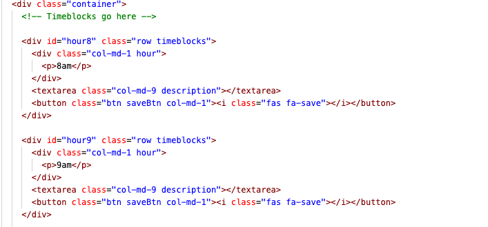
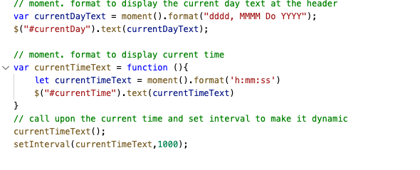
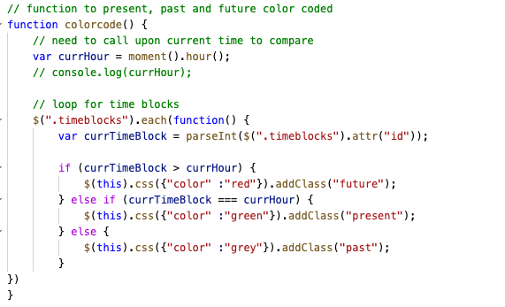
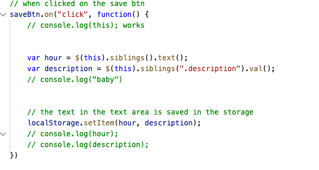
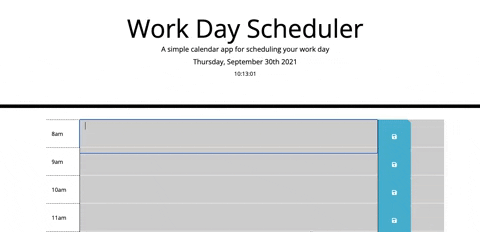

# workday-scheduler
This is a work day schedular given to us with a starter code. I worked on the javascript using jquery, I created current date and dynamic time. I also created time blocks with text areas, to add to do items for the work day. I also created a local storage to save the items by clicking a button.

## Getting Started

* create a repo
* write pseudocode 
* added time bloxks to HTML 
* added js using jquery

### Steps
// moment. format to display the current day text at the header
// moment. format to display current time
// call upon the current time and set interval to make it dynamic
// calling upon elements
// function to present, past and future color coded 
// need to call upon current time to compare
// loop for time blocks
// when clicked on the save btn
// the text in the text area is saved in the storage
// need to get item and stay after refreshing
// lets call the functions 

### Images

## Built With

* [HTML] (index.html)
* [CSS] (style.css)
* [Javascript] (script.js)

## Deployed Link

* [See Live Site](#)https://github.com/umeramalek/workday-scheduler
https://umeramalek.github.io/workday-scheduler/

## Authors

* **UMERA MALEK** 

- [Link to Portfolio Site](https://umeramalek.github.io/)
- [Link to Github](https://github.com/umeramalek)
- [Link to LinkedIn](www.linkedin.com/in/umeramalek)

